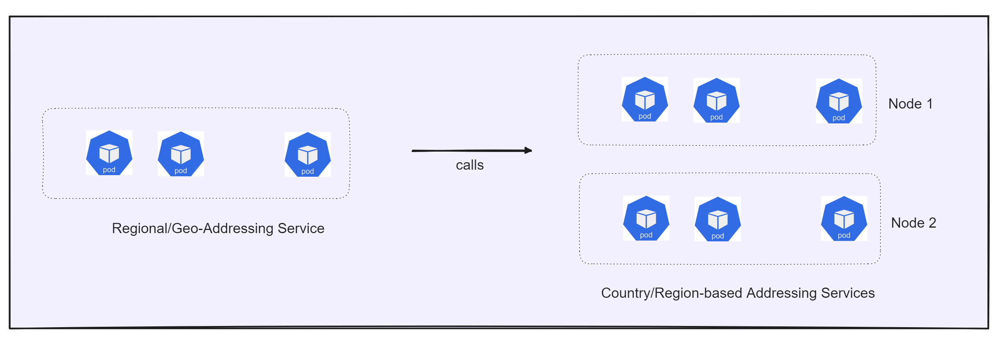

# Precisely Geo-Addressing Service Helm Chart for Kubernetes

## Description

Precisely Geo-Addressing Service Helm Chart is a standard way for deploying geo-addressing services in
``kubernetes`` environment using a single helm command.  

The Helm Chart works with *proprietary and highly optimized docker images* provided by Precisely.

# Geo-Addressing Application

The Geo-Addressing Application provides the following capabilities, which are available as REST web services hosted on K8s environment using Helm Chart:

- **Verify Service** - performs address verification and standardization using the specified processing engine.
- **Geocode Service** - performs forward geocoding using input addresses and returning location data and other information.
- **Autocomplete Service**: yeilds matched addresses and place for the given input addresses.
- **Reverse Geocode Service** - performs reverse geocoding using input coordinates and returns address information that is the best match for that point.
- **Lookup Service**: returns geocoded candidates when given a unique key.

For complete Geo-Addressing documentation, follow [Geo-Addressing API Guide](https://docs.precisely.com/docs/sftw/ggs/5.0/en/webhelp/GeoAddressingSDKDeveloperGuide/GlobalGeocodingGuide/source/AddressingAPI/addressing_api_title.html).

## Features
- Ease of deployment using helm charts.
- Country specific deployments of geo-addressing application for higher throughput.
- Improved API performance for geo-addressing APIs.
- ZERO DOWNTIME Data Upgrades.

## Architecture

The core of the geo-addressing helm-chart based solution is dependent on OAS (Operational Addressing SDK) which provides various capabilities like address verification (verify), geocode, reverse geocode, parse, etc.

The regional-addressing termed as `geo-addressing helm chart` is the parent helm chart responsible for deploying the geo-addressing-service.
This service exposes the operational addressing API endpoints, and calls the underlying country-based services for processing the requests.

The Addressing-Service termed as `addressing-svc helm chart` is a sub-chart of geo-addressing helm chart which is responsible for deploying individual country/region based addressing services.
The service is deployed with the reference data mounted in Network Storage, and is responsible for performing the operational-addressing capabilities.

### Reference Data Management

Geo-Addressing solution uses reference data (country-specific data) on mounted file storage for operational addressing operations. This reference data needs to be present in cluster's mounted storage before calling/deploying the Geo-Addressing Helm Chart.

To keep the different reference data updates, new data will be uploaded on specific location or folder of mounted storage and Geo-Addressing Helm Chart will be rolled with new reference data location with Zero downtime.

To download the reference data (country-specific data) and all the requirement components to run the Helm Chart, visit [Precisely Data Portfolio](https://dataguide.precisely.com/) where you can also sign up for a free account and access files available in [Precisely Data Experience](https://data.precisely.com/).

## Next Sections

- [Installation on EKS Cluster](./eks/README.md)
- [Installation on Local Docker Desktop](./eks/docker-desktop/README.md)