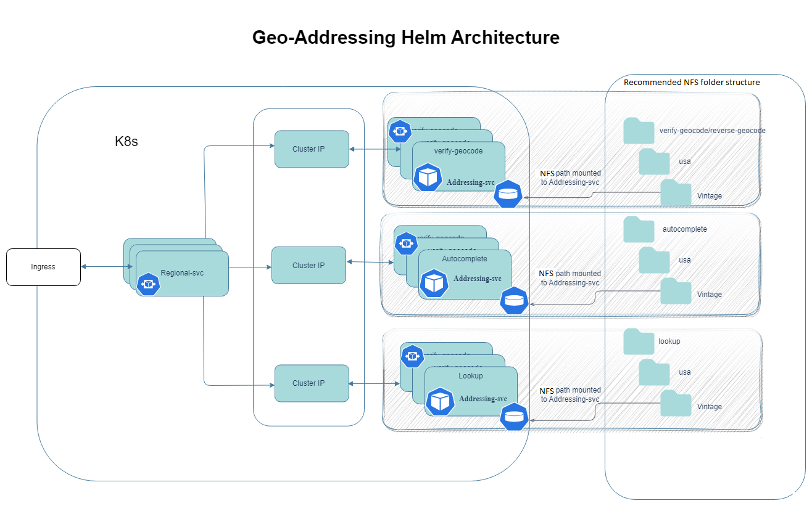

# Geo Addressing Helm Charts

## Motivation

1. **Simplify Deployment:**
    - Streamline the Geo-Addressing SDK deployment process.
    - Ensure an effortless deployment experience.
    - Eliminate complexities for users when setting up the SDK.

2. **Seamless Updates:**
    - Guarantee seamless updates for both data and software.
    - Aim for zero downtime during updates, ensuring uninterrupted service.

3. **Hassle-Free Deployments:**
    - Prioritize user-centric deployment experiences.
    - Minimize potential deployment challenges and issues.

4. **Ready-Made Solution:**
    - Develop a plug-and-play solution for immediate use.
    - Minimize the need for extensive setup or configuration.

5. **Language-Barrier Elimination:**
    - Expose all SDK functionalities as REST endpoints.
    - Allow consumption of these endpoints by any type of client.
    - Eliminate language barriers, enabling broader compatibility.

6. **Microservices Deployment for Scalability:**
    - Create multiple microservices around the SDK.
    - Move away from building a single monolithic application for each SDK functionality.
    - Enhance scalability and flexibility by adopting a microservice architecture.

> This solution is specifically for users who are looking for REST interface to interact with Geo Addressing SDK and Kubernetes based deployments.

> [!IMPORTANT]
> 1. Please consider these helm charts as recommendations only. They come with predefined configurations that may not be the best fit for your needs. Configurations can be tweaked based on the use case and requirements.
> 2. These charts can be taken as a reference on how one can take advantage of the precisely data ecosystem and build a number of services around the same piece of software, creating a collection of microservices that can scale on a need basis.

## Architecture

 The core of the geo-addressing helm-chart-based solution relies on the Operational Addressing SDK (OAS). The robust
functionality of OAS forms the backbone of our geo-addressing solution, empowering it to deliver accurate and efficient
geo-addressing services while maintaining data integrity and usability.

The geo-addressing application is designed as a robust microservice-based architecture, utilizing a modular approach to
provide highly optimized, scalable and precise addressing solutions.

### Capabilities

Within this architecture, there are two key types of microservices:

- _Regional Addressing Service_: This microservice is an interface exposed to user consisting all the endpoints
  pertaining the geo-addressing capabilities:
    - **_Verify_**: performs address verification and standardization using the specified processing engine.
    - **_Geocode_**: performs forward geocoding using input addresses and returning location data and other information.
    - **_Reverse Geocode_**: performs reverse geocoding using input coordinates and returns address information that is
      the best match for that point.
    - **_Autocomplete_**: yields matched addresses and place for the given input addresses.
    - **_Lookup Service_**: returns geocoded candidates when given a unique key.
- _Addressing Service_ (Country-Specific): These microservices are specialized for individual countries, allowing us to
  cater to unique addressing requirements and regulations in different regions. Each country-based addressing service is
  optimized for accuracy within its specific jurisdiction.

## Components

- [Reference Data](docs/ReferenceData.md)
- [Docker Images](scripts/images-to-ecr-uploader/README.md#description)
- [Helm Charts](charts/geo-addressing/README.md#helm-charts)

## Guides

- [Reference Data Installation](charts/reference-data-setup/README.md)
- [Quickstart Guide](docs/guides/eks/QuickStartEKS.md)
- [Upgrade Guide](docs/guides/eks/UpgradeGuide.md)
- [Uninstall Guide](docs/guides/eks/UninstallGuide.md)

## Setup

- [Local Setup](docker-desktop/README.md)
- [Kubernetes Setup](charts/geo-addressing/README.md)

> NOTE: As of now, geo-addressing helm chart is only supported for AWS EKS.

## Geo-Addressing Helm Version Chart

Following is the helm version chart against geo-addressing PDX docker image version and GA-SDK version.

| Docker Image PDX Version & GA-SDK Version     | Helm Chart Version |
|-----------------------------------------------|--------------------|
| `999.638.718/2023.9/Sept 12,2023` & `5.1.488` | `0.1.0` - `0.4.0`️ |

> NOTE: The docker images pushed to the image repository should be tagged with the current helm chart version. Refer [Downloading Geo-Addressing Docker Images](docs/guides/eks/QuickStartEKS.md#step-3-download-geo-addressing-docker-images) for more information.
 
## Miscellaneous

- [Metrics](docs/MetricsAndTraces.md#generating-insights-from-metrics)
- [Application Tracing](docs/MetricsAndTraces.md#generating-insights-from-metrics)
- [Logs and Monitoring](docs/MetricsAndTraces.md#generating-insights-from-metrics)
- [FAQs](docs/faq/FAQs.md)

## References

- [Releases](https://github.com/PreciselyData/cloudnative-geocoding-helm/releases)
- [Helm Values](charts/geo-addressing/README.md#helm-values)
- [Environment Variables](charts/geo-addressing/README.md#environment-variables)
- [Memory Recommendations](charts/geo-addressing/README.md#memory-recommendations)
- [Geo-Addressing Service API Usage](charts/geo-addressing/README.md#geo-addressing-service-api-usage)

## Links

- [Geo-Addressing API Guide](https://docs.precisely.com/docs/sftw/ggs/5.0/en/webhelp/GeoAddressingSDKDeveloperGuide/GlobalGeocodingGuide/source/AddressingAPI/addressing_api_title.html)
- [Geo-Addressing Custom Output Fields](https://docs.precisely.com/docs/sftw/ggs/5.0/en/webhelp/GeoAddressingSDKDeveloperGuide/GlobalGeocodingGuide/source/CustomFields/global_custom_output_fields_all_countries.html)
- [Helm Chart Tricks](https://helm.sh/docs/howto/charts_tips_and_tricks/)
- [Nginx Ingress Controller](https://docs.nginx.com/nginx-ingress-controller/)