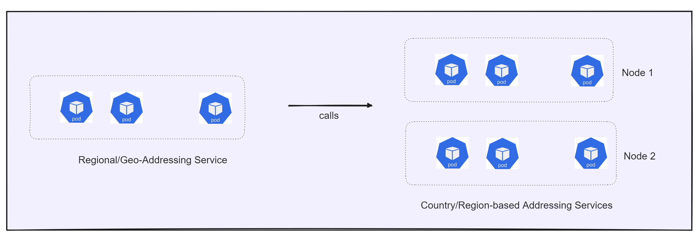

# Precisely Geo-Addressing Service Helm Chart for Kubernetes

## Description

The Precisely Geo-Addressing Service Helm Chart offers a standardized approach for deploying geo-addressing services in
a [Kubernetes](https://kubernetes.io/) environment with [Helm](https://helm.sh/).

This repository contains all the information necessary for deploying the Geo-Addressing Application and harnessing its
capabilities within your [kubernetes](https://kubernetes.io/) environment using [Helm](https://helm.sh/).

# Geo-Addressing Application

The Geo-Addressing Application provides the following capabilities, which are available as REST web services hosted on
K8s environment using Helm Chart:

- **Verify Service** - performs address verification and standardization using the specified processing engine.
- **Geocode Service** - performs forward geocoding using input addresses and returning location data and other
  information.
- **Autocomplete Service**: yeilds matched addresses and place for the given input addresses.
- **Reverse Geocode Service** - performs reverse geocoding using input coordinates and returns address information that
  is the best match for that point.
- **Lookup Service**: returns geocoded candidates when given a unique key.

For complete Geo-Addressing documentation,
follow [Geo-Addressing API Guide](https://docs.precisely.com/docs/sftw/ggs/5.0/en/webhelp/GeoAddressingSDKDeveloperGuide/GlobalGeocodingGuide/source/AddressingAPI/addressing_api_title.html)
.

## Architecture

The core of the geo-addressing helm-chart based solution is dependent on OAS (Operational Addressing SDK) which provides
various capabilities like address verification (verify), geocode, reverse geocode, parse, etc.

The [regional-addressing service](charts/geo-addressing) is responsible for exposing the operational addressing
API endpoints, and calls the underlying requirement-based country-specific addressing services
viz. [addressing service](charts/geo-addressing/charts/addressing-svc)
, [autocomplete service](charts/geo-addressing/charts/autocomplete-svc)
, [lookup service](charts/geo-addressing/charts/lookup-svc)
, [reverse-geocode service](charts/geo-addressing/charts/reverse-svc) for processing the requests.

## Key Features

- Ease of deployment for Geo-Addressing Application with Helm.
- Requirement-based country specific deployments of geo-addressing application.
- ZERO DOWNTIME Software and Reference Data Upgrades.
- Improved API performance, higher throughput and scalable geo-addressing APIs.

### Reference Data Management

The Geo-Addressing solution relies on reference data (country-specific data) stored on mounted file storage for operational addressing operations. It's crucial to ensure that this reference data is available in the cluster's mounted storage before initiating the deployment of the Geo-Addressing Helm Chart.

To accommodate reference data and software upgrades, you should upload newer data to the recommended location or folder on the mounted storage. The Geo-Addressing Helm Chart can then be rolled out with the new reference data location seamlessly and with zero downtime.

To download the reference data (country-specific data) and all the requirement components to run the Helm Chart,
visit [Precisely Data Portfolio](https://dataguide.precisely.com/) where you can also sign up for a free account and
access files available in [Precisely Data Experience](https://data.precisely.com/).

## Next Sections
- [Geo-Addressing Helm Chart Design](charts/geo-addressing)
- [Quickstart Guide for EKS](docs/guides/eks/QuickStartEKS.md)
- [Trying out on Local Docker Desktop](docker-desktop/README.md)
- [FAQs](docs/faq/FAQs.md)