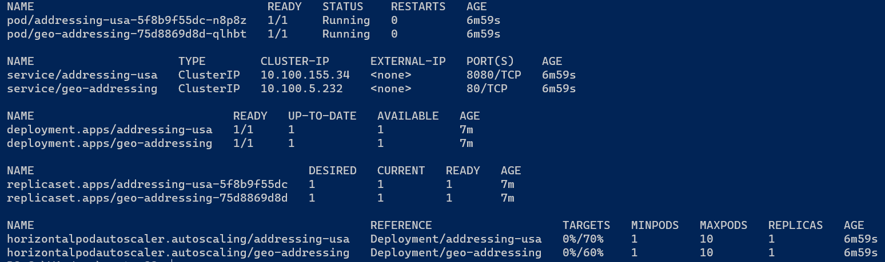

## FAQs

If you encounter any challenges or have questions during the deployment of the geo-addressing helm chart, we recommend
checking the below questions. This resource provides answers to common questions and solutions to known issues, offering
assistance in troubleshooting any deployment-related difficulties you may encounter. If your question is not covered in
the FAQs, feel free to reach out to our support team for personalized assistance.

<br>
1. How can I monitor the Geo-Addressing Helm Chart is installation?
   <br><br>
   Once you run the helm chart command, you can monitor the helm chart creation by using the following command:
    ```shell
    kubectl get pods -n [geo-addressing] -w
    ```

Please wait for all the services to be in the running stage:


2. How to check the logs if the helm chart installation is unsuccessful?
   <br><br>
   In case of failure during helm chart installation, you can view the status of the pods by using the following
   command:
   ```shell
   kubectl get pods -n [geo-addressing]
   ```
   For each failed pod, you can check the logs or describe the pods for viewing the failure events with the following
   command:
   ```shell
   kubectl logs -f [pod-name] -n [geo-addressing]
   kubectl describe pod [pod-name] -n [geo-addressing]
   ```

   The geo-addressing helm chart runs few jobs also, in that case, you might also want to check the failed jobs using
   following command:
   ```shell
   kubectl get jobs -n [geo-addressing]
   ```
   You can view the logs or describe the job for failure events using following command:
   ```shell
   kubectl logs -f [job-name] -n [geo-addressing]
   kubectl describe job [job-name] -n [geo-addressing]
   ```
3. How to clean up the resources if the helm-chart installation is unsuccessful?
   <br><br>
   Helm command will fail mostly because of missing mandatory parameters or not overriding few of the default
   parameters. Apart from mandatory parameters, you can always override the default values in
   the [values.yaml](../../charts/geo-addressing/values.yaml) file by using the --set parameter.

   However, you can view the logs and fix those issues by cleaning up and rerunning the helm command.
    ```shell
    kubectl describe pod [POD-NAME] -n [geo-addressing]
    kubectl logs [POD-NAME] -n [geo-addressing]
    ```

   To clean up the resources, use the following commands:
    ```shell
    helm uninstall geo-addressing -n [geo-addressing]
    kubectl delete job geo-addressing-data-vintage -n [geo-addressing]
    kubectl delete pvc addressing-hook-svc-pvc -n [geo-addressing]
    ```

[🔗 Return to `Table of Contents` 🔗](../../README.md#miscellaneous)