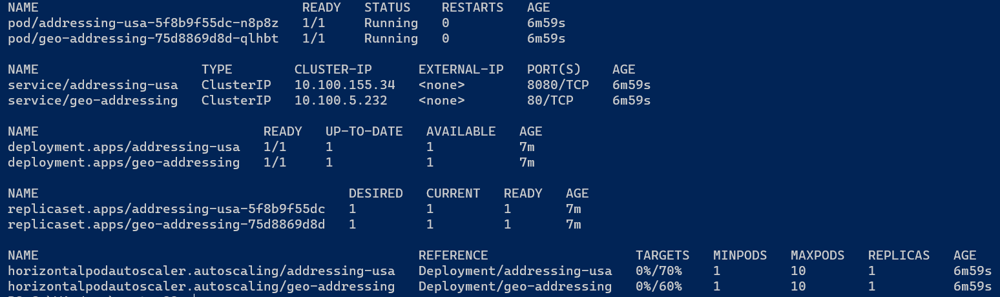

# Geo-Addressing Helm Chart Deployment Guide for for EKS

## Description

Precisely Geo-Addressing Service Helm Chart is a standard way for deploying geo-addressing services in
on-prem ``kubernetes`` environment using a single helm command. <br>

This helm chart is responsible for deploying the geo addressing service along with all the provided country-based
addressing services.


## Pre-requisites

To deploy the Geo-Addressing application in a Kubernetes environment, install the following client tools:

- [kubectl](https://kubernetes.io/docs/tasks/tools/install-kubectl/)
- [helm3](https://helm.sh/docs/intro/install/)

##### Amazon Elastic Kubernetes Service (EKS)

- [aws-cli](https://docs.aws.amazon.com/cli/latest/userguide/cli-chap-install.html)
- [eksctl](https://docs.aws.amazon.com/eks/latest/userguide/getting-started-eksctl.html)

## Infrastructure Requirements

[Here are the pre-requisites](./charts/README.md) that needs to be verified before installing geo-addressing helm chart.

The requirements need to be checked before installing helm chart are as follows:

1. Required docker images in ECR
2. Cluster with Autoscaler
4. Ingress Controller, Metrics API Server and EFS CSI driver installed on cluster
5. Reference data in EFS in the format (/[api]/[country]/[vintage]/ e.g. */verify-geocode/usa/202307/* or */autocomplete/usa/202307/*)

## Running the Helm Chart

To run the geo-addressing helm chart use the following command:

```shell
helm install geo-addressing .\charts\geo-addressing\ \
--dependency-update \
--set "global.awsRegion=[aws-region]" \ 
--set "global.efs.fileSystemId=[file-system-id]" \
--set "ingress.hosts[0].host=[ingress-host-name]" \ 
--set "ingress.hosts[0].paths[0].path=/precisely/addressing" \
--set "ingress.hosts[0].paths[0].pathType=Prefix" \
--set "global.nodeSelector.node-app=geo-addressing" \
--set "image.repository=[aws-account-id].dkr.ecr.[aws-region].amazonaws.com/regional-addressing-service" \
--set "global.addressingImage.repository=[aws-account-id].dkr.ecr.[aws-region].amazonaws.com/addressing-service" \
--set "global.countries={usa,gbr}" \
--namespace geo-addressing --create-namespace
```

By default only verify/geocode API's are enabled by above command.
To enable other API's like autocomplete, lookup and reverse-geocode you can also set the parameters in helm command as follows.

```shell
--set "autocomplete-svc.enabled=true"
--set "lookup-svc.enabled=true"
--set "reverse-svc.enabled=true"
```

In case the base root path of data for an API (verify-geocode,autocomplete,lookup,reverse) is different from [mentioned](README.md#infrastructure-requirements) format in point 5 then set the root path for an API using below parameters.

```shell
--set global.efs.addressingBasePath=<your_efs_path>
--set global.efs.autoCompleteBasePath=<your_efs_path>
--set global.efs.lookupBasePath=<your_efs_path>
--set global.efs.reverseBasePath=<your_efs_path>
```

*Example:*
*Here the data for verify/geocode API's is on the root of EFS therefore set base path '.'*

```shell
--set global.efs.addressingBasePath=.
```

Please refer [values.yaml](./charts/geo-addressing/values.yaml) to update any of the default parameters in the helm command.

### Mandatory Parameters

* ``global.awsRegion``: AWS Region
* ``global.efs.fileSystemId``: The ID of the EFS
* ``global.countries``: Required countries for Geo-Addressing (e.g. ``--set "global.countries={usa,deu,gbr}"``). Possible Values are: (usa,gbr,deu,aus,fra,can,mex,bra,arg,rus,ind,sgp,nzl,jpn,tgl,world)
* ``ingress.hosts[0].host``: The Host name of Ingress e.g. http://aab329b2d767544.us-east-1.elb.amazonaws.com
* ``ingress.hosts[0].paths[0].path``: The PATH at which the solution to be hosted. (e.g. ``/precisely/addressing``)
* ``ingress.hosts[0].paths[0].pathType``: The pathType of the Ingress Path
* ``image.repository``: The ECR image repository for the regional-addressing image
* ``global.addressingImage.repository``: The ECR image repository for the addressing-service image
* ``global.nodeSelector``: The node selector to run the geo-addressing solutions on nodes of the cluster

## Geo-Addressing Service API Usage

The geo-addressing service exposes different operational-addressing APIs like geocode, verify, reverse-geocode, lookup, etc.

You can use the [postman collection](./Geo-Addressing-Helm.postman_collection.json) provided in the repository for hitting the APIs.

Few APIs and sample requests are provided below:

### `/li/v1/oas/geocode`:
API to geocode the addresses


Sample Request:
```curl
curl -X 'POST' \
  'https://[EXTERNAL-URL]/li/v1/oas/geocode' \
  -H 'accept: application/json' \
  -H 'Content-Type: application/json' \
  -d '{
  "preferences": {
    "returnAllInfo": true
  },
  "addresses": [
    {
      "addressLines": [
        "1700 district ave #300 burlington, ma"
      ],
      "country": "USA"
    }
  ]
}'
```

### `/li/v1/oas/verify`:
API to verify the addresses


Sample Request:
```curl
curl -X 'POST' \
  'https://[EXTERNAL-URL]/li/v1/oas/verify' \
  -H 'accept: application/json' \
  -H 'Content-Type: application/json' \
  -d '{
  "preferences": {
    "returnAllInfo": true
  },
  "addresses": [
    {
      "addressLines": [
        "1700 district ave #300 burlington, ma"
      ],
      "country": "USA"
    }
  ]
}'
```

### `/li/v1/oas/reverse-geocode`:
API to reverse-geocode the addresses

Sample Request:
```curl
curl -X 'POST' \
  'https://[EXTERNAL-URL]/li/v1/oas/reverse-geocode' \
  -H 'accept: application/json' \
  -H 'Content-Type: application/json' \
  -d '{
  "preferences": {
    "maxResults": 1,
    "returnAllInfo": true
  },
  "locations": [
    {
      "longitude": -73.704719,
      "latitude": 42.682251,
      "country": "USA"
    }
  ]
}'
```


### `/li/v1/oas/lookup`:
API to lookup the addresses

Sample Request:
```curl
curl -X 'POST' \
  'https://[EXTERNAL-URL]/li/v1/oas/lookup' \
  -H 'accept: application/json' \
  -H 'Content-Type: application/json' \
  -d '{
  "preferences": {
    "type": "preferences",
    "returnAllInfo": true
  },
  "keys": [
    {
      "key": "P0000GL41OME",
      "country": "USA",
      "type": "PB_KEY"
    }
  ]
}'
```


## FAQs

1. How can I check whether the Geo-Addressing Helm Chart is installed or not?
<br><br>
    Once you run the helm chart command, you can monitor the helm chart creation by using the following command:
    ```shell
    kubectl get pods -n geo-addressing -w
    ```
    
    Please wait for all the services to be in the running stage:
    

2. How to clean up the resources if the helm-chart installation is unsuccessful?
<br><br>
    Helm command will fail mostly because of missing mandatory parameters or not overriding few of the default parameters.
    Apart from mandatory parameters, you can always override the default values in the [values.yaml](./charts/geo-addressing/values.yaml) file by using the --set parameter.
    
    However, you can view the logs and fix those issues by cleaning up and rerunning the helm command.
    ```shell
    kubectl describe pod [POD-NAME] -n geo-addressing
    kubectl logs [POD-NAME] -n geo-addressing
    ```
    
    To clean up the resources, use the following commands:
    ```shell
    helm uninstall geo-addressing -n geo-addressing
    kubectl delete job geo-addressing-data-vintage -n geo-addressing
    kubectl delete pvc addressing-hook-svc-pvc -n geo-addressing
    ```