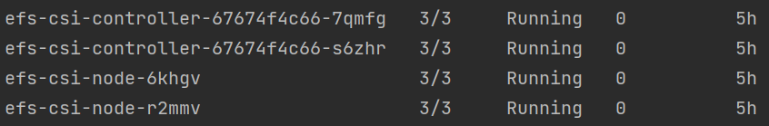

# Addressing Infrastructure Requirement Validation

## Description

This section describes the infrastructure requirements for Geo-Addressing Helm Chart. Following are the steps required
as an infrastructure setup. **If you already have one of the things installed in your infrastructure, please skip those
steps**.

1. Upload the required docker images to ECR
2. Create the Cluster
3. Create cluster autoscaler for HPA
4. Create Ingress Controller, Metrics API Server and EFS CSI Driver
5. Create EFS
6. Download Reference Data in the Node and Mount it to EFS

# Requirements

## Uploading Docker Images to ECR

This projects assumes the docker images to be present in the ECR. However, if you haven't pushed the required docker
images in the ECR, please follow below steps to upload the images to ECR

The docker files can be downloaded from Precisely Data. For information about Precisely's data portfolio, see
the [Precisely Data Guide](https://dataguide.precisely.com/) where you can also sign up for a free account and access
docker files available in [Precisely Data Experience](https://data.precisely.com/).

A python script is provided, which helps in downloading docker images from Precisely Data Experience and pushing it to
your AWS Account.
(Note: This script requires python, docker and awscli to be installed in your system)

```shell
cd ../scripts/addressing_images_to_ecr
pip install -r requirements.txt
python upload_ecr.py --pdx-api-key [pdx-api-key] --pdx-api-secret [pdx-secret] --aws-access-key [aws-access-key] --aws-secret [aws-secret] --aws-region [aws-region]
```

Two docker images will be downloaded in the local docker repository:

1. regional-addressing-service:latest
2. addressing-service:latest

For more details, follow the instructions [here](../scripts/images-to-ecr-uploader/README.md)

### Verify docker images locally (Optional):

To verify whether the working of downloaded docker images or to setup the geo-addressing infra locally for testing
purpose, follow the instruction in the [docker-desktop section](../docker-desktop/README.md).

## Creating EKS Cluster and Autoscaler for HPA

This project has a sample script to create EKS cluster and autoscaler. Please run the below command to create EKS
cluster.

```shell
eksctl create cluster -f ../cluster-sample/create-eks-cluster.yaml
kubectl apply -f ../cluster-sample/cluster-auto-scaler.yaml
```

## Ingress Controller and Metrics API Server

The geo-addressing service requires ingress controller setup. Use the following command for setting up NGINX ingress
controller:

```shell
helm repo add ingress-nginx https://kubernetes.github.io/ingress-nginx
helm install nginx-ingress ingress-nginx/ingress-nginx --set "controller.nodeSelector.node-app=geo-addressing-ingress"
```

*Note: You can update the nodeSelector according to your cluster's ingress node.*

Once ingress controller setup is completed, you can verify the status and get the ingress URL by using the following
command:

```shell
kubectl get services -o wide -w nginx-ingress-ingress-nginx-controller
```

For Horizontal Pod Autoscaler to work, a metrics API server needs to be installed. Please use the below command for
installing Metrics API server:

```shell
kubectl apply -f https://github.com/kubernetes-sigs/metrics-server/releases/latest/download/components.yaml
```

To check the Metrics Server API, use the below command:

```shell
kubectl get deployment metrics-server -n kube-system
```

## Verifying EFS CSI Driver

[The Amazon EFS CSI Driver](https://docs.aws.amazon.com/eks/latest/userguide/efs-csi.html) is required as a
pre-requisite to mount EFS during installation of geo-addressing helm charts.

To verify whether EFS CSI Driver is installed or not, run the following command:

```shell
kubectl get pods -n kube-system
```

The output should be similar to:


If EFS CSI Driver is not installed, install it using following commands:

```shell
helm repo add aws-efs-csi-driver https://kubernetes-sigs.github.io/aws-efs-csi-driver/
helm repo update aws-efs-csi-driver
helm upgrade --install aws-efs-csi-driver --namespace kube-system aws-efs-csi-driver/aws-efs-csi-driver
```

## Creating EFS or Linking it to EKS Cluster

This project provides a python script to create the EFS script and link it to the existing EKS cluster (or directly link
the existing EFS to EKS cluster) by creating the mount targets.

The script requires python and awscli to be installed in your system.

Run the following command if you want to create EFS and link it to the EKS cluster:

```shell
cd ../scripts/efs-creator
pip install -r requirements.txt
python ./create_efs.py --cluster-name [eks-cluster-name] --aws-access-key [aws-access-key] --aws-secret [aws-secret] --aws-region [aws-region] --efs-name [precisely-geo-addressing-efs] --security-group-name [precisely-geo-addressing-sg]
```

OR run the following commands if you already have EFS and want to link it to EKS cluster:

```shell
cd ../scripts/efs-creator
pip install -r requirements.txt
python ./create_efs.py --cluster-name [eks-cluster-name] --existing true --aws-access-key [aws-access-key] --aws-secret [aws-secret-key] --aws-region [aws-region] --file-system-id [file-system-id] 
```

For more details, follow the instructions [here](../scripts/efs-creator/README.md)

## Reference Data Mounting on EFS

If you haven't downloaded the reference data and mounted it to EFS, there is a miscellaneous helm chart which will be
helpful for downloading the reference data SPDs from PDX, extracting it to the worker node and mounting the extracted
data to EFS.

Please contact to Precisely's Team for the required docker images to run this chart.

Run the below command to installing the helm chart of Geo-Addressing Data Setup.

```shell
helm install addressing-data ./addressing-data-setup/ --set "global.pdxApiKey=[YOUR-API-KEY]" --set "global.pdxSecret=[YOUR-SECRET]" --set "global.efs.fileSystemId=[EFS-FILESYSTEM-ID]" --set "dataDownload.image.repository=[AWS_ACCOUNT_ID].dkr.ecr.[AWS_REGION].amazonaws.com/pdx-s3-extractor" --set "global.countries={usa,gbr}" --dependency-update --timeout 60m
```

#### Parameters:

* ``global.pdxApiKey``: Your PDX API Key
* ``global.pdxSecret``: Your PDX API Secret
* ``global.countries``: Supported countries for Geo-Addressing Data Download (
  e.g. ``--set "global.countries={usa,deu,gbr}"``)
* ``global.awsRegion``: AWS Region
* ``global.mountBasePath``: The mounted base path (default is ``/mnt/data/geoaddressing-data``). The full path of the
  exploded data for ``usa`` country will be (``basePath/[api]/[country]/[vintage]`` e.g. */mnt/data/geoaddressing-data/verify-geocode/usa/202307/*)
